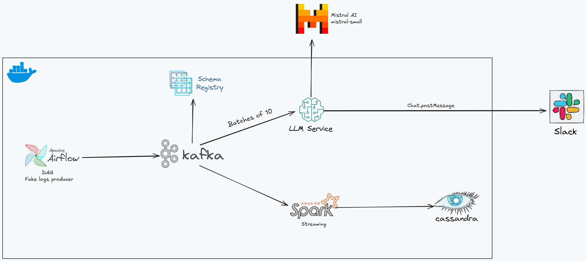

# Real-time Logs Processing Pipeline
> A modern approach to log analysis using Airflow, Kafka, Spark, Cassandra, Mistral AI, and Slack



## Overview

This project showcases a real-time log processing pipeline that combines the power of data engineering tools with AI-powered analysis. By integrating streaming data processing with artificial intelligence, the system can automatically detect, analyze, and alert on potential issues in your logs.

## How It Works

The pipeline follows a seamless flow of data through several specialized components:

1. **Log Generation & Orchestration**
   Apache Airflow manages the generation of simulated log data through scheduled DAGs, providing a reliable and monitored source of log events.

2. **Real-time Data Streaming**
   Apache Kafka serves as the backbone of our real-time data pipeline, providing a robust message queue that can handle high-throughput log ingestion. The system leverages Kafka's pub/sub model to distribute logs to multiple consumers efficiently.

3. **Parallel Processing Streams**
   The log data flows through two parallel processing streams:
   - **Stream Processing**: Apache Spark Streaming continuously processes all incoming logs, transforming and storing them in Cassandra for long-term storage and analysis.
   - **Error Analysis**: A dedicated log analyzer service monitors for error messages, leveraging Mistral AI to provide intelligent analysis of potential issues.

4. **Intelligent Error Analysis**
   When errors are detected, Mistral AI analyzes the context and patterns to provide insights about potential root causes and solutions

5. **Real-time Notifications**
   Critical findings are immediately communicated through Slack, ensuring that relevant team members are promptly notified of any significant issues.

## Understanding Kafka's Role

The system implements a dual-consumer pattern with Kafka, utilizing different consumption approaches for distinct purposes:

### Spark Streaming Consumer
- Uses Kafka's Structured Streaming API for continuous processing
- Processes all messages through a streaming pipeline

### Log Analyzer Consumer
- Implements batch processing using the Kafka Consumer API
- Uses a dedicated consumer group (`batch_consumer_group`) for independent processing
- Processes messages in configurable batches (default: 10 messages)
- Focuses specifically on ERROR severity messages for AI analysis

### Shared Characteristics
- Both consumers read from the same `logs` topic independently
- Each maintains its own offset position, allowing for:
  - Complete historical data processing by Spark
  - Targeted error analysis by the Log Analyzer
  - Independent scaling and restart capabilities
- Messages remain available in Kafka until the retention period expires
- Both start from the earliest available messages to ensure comprehensive processing

This architecture ensures that all logs are properly stored for historical analysis while allowing for immediate error detection and notification, without either consumer interfering with the other's operation.
## Components Deep Dive

### Airflow DAGs
- `kafka_stream.py`: Orchestrates the log generation pipeline
- `fake_log_generator.py`: Produces simulated log data

### Real-time Processing
- **Spark Streaming** (`spark/spark_stream.py`): Handles continuous log processing and storage
- **Log Analyzer** (`log_analyzer/`):
  - `batch_consumer.py`: Manages Kafka consumption and error detection
  - `mistral_utils.py`: Interfaces with Mistral AI for intelligent analysis
  - `slack_utils.py`: Handles notification delivery
  - `message_formatter.py`: Structures notifications for clarity

### Storage & Messaging
- **Kafka**: Handles real-time message queuing
- **Cassandra**: Provides scalable storage for processed logs
- **Slack**: Delivers actionable notifications

## Getting Started

### Prerequisites
- Docker
- Docker Compose

### Quick Start

1. Clone the repository:
```bash
git clone <repository_url>
cd <repository_directory>
```

2. Set up your environment:
```bash
# Create .env file with your credentials
cat << EOF > .env
SLACK_BOT_TOKEN=<your_slack_bot_token>
MISTRAL_API_KEY=<your_mistral_ai_api_key>
EOF
```

3. Launch the pipeline:
```bash
docker-compose up -d
```

4. Access the services:
- Airflow UI: http://localhost:8080
- Monitor your Slack channel for notifications

## Customization

The pipeline is designed to be highly customizable. Key areas for modification include:

- Log Generation: Adjust `fake_log_generator.py` to match your log patterns
- Error Analysis: Modify the Mistral AI prompts in `mistral_utils.py`
- Notification Format: Customize Slack messages in `message_formatter.py`
- Storage Schema: Adapt the Cassandra schema for your specific needs

## Contributing

We welcome contributions! Feel free to submit pull requests or open issues for discussion.
